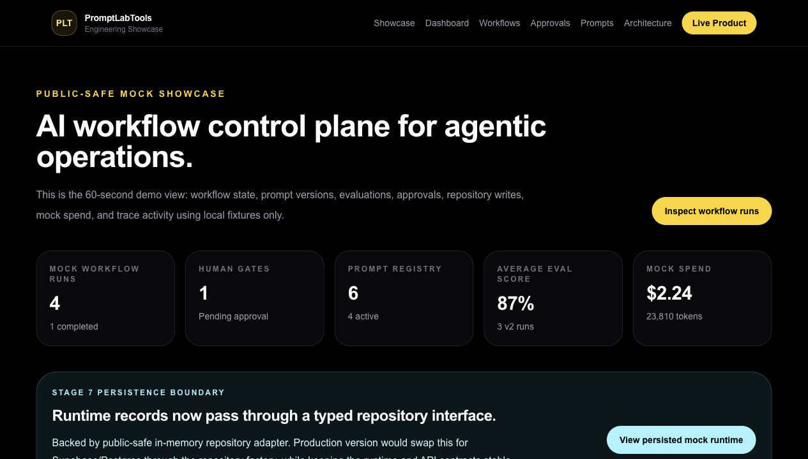

# PromptLabTools Engineering Showcase

[](https://github.com/jesal-tailor/promptlabtools-engineering-showcase/actions/workflows/ci.yml)
[](https://nextjs.org/)
[](https://www.typescriptlang.org/)
[](./LICENSE)

Public-safe AI Platform Engineering showcase for an agentic workflow control plane.

This repo demonstrates how I model and build the platform layer around AI workflows: deterministic mock agents, orchestration, human approval gates, prompt and tool governance, evaluation checks, trace-style observability, repository boundaries, API contracts, deployment readiness, tests, docs, and CI. It is a curated proof-of-work project, not a copy of the private PromptLabTools production codebase.

**Purpose:** Give recruiters, hiring managers, and technical interviewers a public-safe way to review AI Platform Engineering, Agentic Workflow, and Developer Platform skills without exposing production PromptLabTools systems.

**Live Preview:** [https://promptlabtools-engineering-showcase.vercel.app](https://promptlabtools-engineering-showcase.vercel.app/)



## Live Preview

Live Preview: [https://promptlabtools-engineering-showcase.vercel.app](https://promptlabtools-engineering-showcase.vercel.app/)

Recommended review pages:

- `/`
- `/dashboard`
- `/workflows`
- `/workflows/runtime_sample`
- `/approvals`
- `/prompts`
- `/evaluations`
- `/tools`
- `/tools/audit`
- `/api/health`
- `/api/readiness`

Use [docs/LIVE_PREVIEW_CHECKLIST.md](./docs/LIVE_PREVIEW_CHECKLIST.md) before sharing a deployed preview.

## What This Demonstrates

- AI workflow orchestration with typed state, runtime traces, approval gates, and continuation paths.
- Agent runtime patterns using deterministic planner, drafting, QA, and approval agents.
- Governance layers for prompts, tools, human approvals, audit events, evaluations, and quality regression checks.
- Repository-pattern persistence boundaries using public-safe in-memory adapters only.
- Deployment-ready cloud preview shape with health/readiness endpoints and Vercel configuration.
- Product engineering across Next.js App Router, React, TypeScript, API routes, Tailwind CSS, Vitest, and CI.
- Public-safe architecture: no secrets, no customer data, no real AI provider calls, no webhooks, and no production automation scripts.

## CV / Recruiter Summary

**Role signal:** AI Platform Engineer, Agentic Workflow Engineer, Full-Stack Platform Engineer.

**60-second read:** This is a working mock control plane for safe AI automation. It proves I can design the runtime, governance, evaluation, observability, and persistence boundaries around agent workflows without exposing private production systems.

**Best demo path:** `/dashboard` -> `/workflows` -> `/workflows/runtime_sample` -> `/approvals` -> `/prompts` -> `/evaluations` -> `/tools` -> `/tools/audit` -> `/api/health` -> `/api/readiness`.

## Screenshots

| Area | Screenshot |
| --- | --- |
| Dashboard overview | [dashboard.png](./docs/assets/dashboard.png) |
| Runtime workflow | [workflow-runtime.png](./docs/assets/workflow-runtime.png) |
| Approval governance | [approval-governance.png](./docs/assets/approval-governance.png) |
| Prompt registry | [prompt-registry.png](./docs/assets/prompt-registry.png) |
| Evaluation quality layer | [evaluation-dashboard.png](./docs/assets/evaluation-dashboard.png) |
| Tool sandbox | [tool-sandbox.png](./docs/assets/tool-sandbox.png) |
| Repository boundary | [repository-boundary.png](./docs/assets/repository-boundary.png) |

See [docs/SCREENSHOTS.md](./docs/SCREENSHOTS.md) for the capture checklist.

## 5-Minute Demo Path

1. Open `/dashboard` for the control-plane overview, metrics, recent runs, and Stage 7 repository boundary label.
2. Open `/workflows/runtime_sample` to show the deterministic campaign workflow with agents, tools, approval gate, final package, traces, and memory repository metadata.
3. Open `/approvals/gate_launch-a-public-safe-ai-workflow-showcase-for-cv_publish` to show approved, rejected, and needs-changes outcomes.
4. Open `/prompts` and `/prompts/prompt_campaign_planner_v2` to show prompt ownership, versions, lifecycle state, criteria, and feedback.
5. Open `/evaluations/eval_hist_planner_v2` to show deterministic quality scoring, human feedback, and regression context.
6. Open `/tools` and `/tools/audit` to show permissioned tool execution, blocked high-risk actions, adapter boundaries, and audit records.
7. Explain that every integration is mock-only and public-safe by design.

## Architecture Summary

```text
Next.js App Router UI
  |
  v
Mock workflow control-plane pages
  |
  v
Typed runtime: agents, workflows, approvals, prompts, evaluations, tools
  |
  v
Workflow runner, state machines, evaluation engine, tool sandbox
  |
  v
Repository interfaces
  |
  v
Public-safe in-memory adapters
```

For a diagram, see [docs/ARCHITECTURE_DIAGRAM.md](./docs/ARCHITECTURE_DIAGRAM.md).

## Deployment Readiness

The app is ready for a public-safe Vercel preview:

- `vercel.json` defines Next.js build/dev/install commands.
- `.env.example` documents optional mock-only values.
- No secrets or paid infrastructure are required.
- Health and readiness endpoints are available for preview checks.
- Terraform/AWS files under `infra/` document future productionisation only.

Deployment docs:

- [Deployment guide](./docs/DEPLOYMENT_GUIDE.md)
- [Vercel preview](./docs/VERCEL_PREVIEW.md)
- [Environment variables](./docs/ENVIRONMENT_VARIABLES.md)

## Health And Readiness

- `GET /api/health` returns service health with `publicSafe: true` and `externalCallsEnabled: false`.
- `GET /api/readiness` verifies mock repository, workflow runner, tool registry, evaluation engine, and disabled external integrations.

## Platform Readiness

- [Cloud architecture](./docs/CLOUD_ARCHITECTURE.md)
- [Platform readiness](./docs/PLATFORM_READINESS.md)
- [Operations runbook](./docs/OPERATIONS_RUNBOOK.md)
- [CI/CD](./docs/CI_CD.md)
- [Terraform scaffold](./infra/terraform/aws/README.md)

## Public-Safe Boundary

This repository intentionally excludes:

- Real PromptLabTools production secrets.
- Real webhook URLs, credentials, API keys, or deployment configuration.
- Customer data, private analytics, real lead data, or user exports.
- Proprietary PromptLabTools prompts, scoring rules, funnel logic, or automation scripts.
- Real model-provider calls, publishing actions, GitHub writes, social API calls, or external service calls.
- Durable database connections.

All workflow runs, agents, prompts, tools, approvals, evaluations, costs, tokens, trace entries, and repository records are mock data.

## Quickstart

```bash
npm install
npm run dev
```

Open [http://localhost:3000](http://localhost:3000).

Optional local env file:

```bash
cp .env.example .env.local
```

The showcase flow does not require real environment variables.

## Quality Checks

```bash
npm run lint
npm run typecheck
npm run test
npm run build
npm run check
```

GitHub Actions runs lint, typecheck, tests, and build on push and pull request.

## What Is Real vs Mock

Real engineering work in this repo:

- Next.js and TypeScript implementation.
- Typed domain models and API contracts.
- Workflow modelling and state transitions.
- Approval governance and audit flow.
- Prompt registry, evaluation, tool sandbox, and repository boundary patterns.
- Vitest coverage and CI checks.
- Public-safe documentation.

Mock/public-safe simulation:

- Deterministic agent outputs.
- Fake external tools and adapter responses.
- Fake costs, tokens, metrics, and trace data.
- In-memory repositories only.
- No real AI provider, publishing, GitHub, webhook, social API, database, or production PromptLabTools call.

See [docs/WHAT_IS_REAL_VS_MOCK.md](./docs/WHAT_IS_REAL_VS_MOCK.md) for the full breakdown.

## Documentation

- [Hiring manager summary](./docs/HIRING_MANAGER_SUMMARY.md)
- [Final showcase handoff](./docs/FINAL_SHOWCASE_HANDOFF.md)
- [Application review guide](./docs/APPLICATION_REVIEW_GUIDE.md)
- [Live preview checklist](./docs/LIVE_PREVIEW_CHECKLIST.md)
- [Release notes](./docs/RELEASE_NOTES.md)
- [CV project snippet](./docs/CV_PROJECT_SNIPPET.md)
- [LinkedIn featured snippet](./docs/LINKEDIN_FEATURED_SNIPPET.md)
- [Demo script](./docs/DEMO_SCRIPT.md)
- [Interview talk track](./docs/INTERVIEW_TALK_TRACK.md)
- [What is real vs mock](./docs/WHAT_IS_REAL_VS_MOCK.md)
- [Architecture diagram](./docs/ARCHITECTURE_DIAGRAM.md)
- [Deployment guide](./docs/DEPLOYMENT_GUIDE.md)
- [Vercel preview](./docs/VERCEL_PREVIEW.md)
- [Environment variables](./docs/ENVIRONMENT_VARIABLES.md)
- [Cloud architecture](./docs/CLOUD_ARCHITECTURE.md)
- [Platform readiness](./docs/PLATFORM_READINESS.md)
- [Operations runbook](./docs/OPERATIONS_RUNBOOK.md)
- [CI/CD](./docs/CI_CD.md)
- [Showcase overview](./docs/SHOWCASE_OVERVIEW.md)
- [Recruiter walkthrough](./docs/RECRUITER_WALKTHROUGH.md)
- [Technical skills map](./docs/TECHNICAL_SKILLS_MAP.md)
- [Productionisation plan](./docs/PRODUCTIONISATION_PLAN.md)
- [Agent runtime](./docs/AGENT_RUNTIME.md)
- [Workflow engine](./docs/WORKFLOW_ENGINE.md)
- [Governance model](./docs/GOVERNANCE_MODEL.md)
- [Human approval flow](./docs/HUMAN_APPROVAL_FLOW.md)
- [Audit trail](./docs/AUDIT_TRAIL.md)
- [Observability](./docs/OBSERVABILITY.md)
- [API contracts](./docs/API_CONTRACTS.md)
- [Prompt registry](./docs/PROMPT_REGISTRY.md)
- [Prompt versioning](./docs/PROMPT_VERSIONING.md)
- [Evaluation strategy](./docs/EVALUATION_STRATEGY.md)
- [Human feedback loop](./docs/HUMAN_FEEDBACK_LOOP.md)
- [Quality regression checks](./docs/QUALITY_REGRESSION_CHECKS.md)
- [Tool execution sandbox](./docs/TOOL_EXECUTION_SANDBOX.md)
- [Tool registry](./docs/TOOL_REGISTRY.md)
- [Adapter boundary](./docs/ADAPTER_BOUNDARY.md)
- [Persistence boundary](./docs/PERSISTENCE_BOUNDARY.md)
- [Repository pattern](./docs/REPOSITORY_PATTERN.md)
- [Architecture](./docs/ARCHITECTURE.md)
- [Security and privacy](./docs/SECURITY_AND_PRIVACY.md)
- [Engineering decisions](./docs/ENGINEERING_DECISIONS.md)
- [Development](./docs/DEVELOPMENT.md)
- [Roadmap](./docs/ROADMAP.md)

## Roadmap

Implemented public-safe stages:

- Stage 1: README positioning and reviewer documentation.
- Stage 2: Dashboard prototype, workflow trace views, registries, mock data, and tests.
- Stage 3: Deterministic mock agent runtime, workflow execution engine, trace events, cost estimates, workflow-start API, docs, and tests.
- Stage 4: Human approval governance, audit events, approval decision API, and continuation paths.
- Stage 5: Prompt registry v2, deterministic evaluation engine, human feedback loop, quality regression checks, API routes, UI pages, docs, and tests.
- Stage 6: Tool execution sandbox, mock adapters, permission checks, typed tool errors, audit events, API routes, UI pages, workflow integration, docs, and tests.
- Stage 7: Persistence boundary, repository interfaces, public-safe in-memory adapters, runtime/API integration, docs, and tests.
- Stage 8: Recruiter-ready README, demo docs, screenshot assets, architecture diagram, and UI copy polish.
- Stage 9: Deployment readiness, health/readiness endpoints, Vercel docs, cloud architecture, ops runbook, and Terraform productionisation scaffold.
- Stage 10: Public preview release preparation, final showcase handoff, application review guide, release notes, and CV/LinkedIn snippets.

Future public-safe improvements:

- Add a short demo video.
- Add accessibility checks and visual regression coverage.
- Add OpenAPI-style schema documentation for the mock routes.
- Add example observability dashboards using fixture logs only.
- Publish an optional Vercel preview with no secrets and no real integrations.

## Related Links

- Website: [https://www.promptlabtools.com](https://www.promptlabtools.com)
- Free Guide: [https://www.promptlabtools.com/free-guide](https://www.promptlabtools.com/free-guide)
- LinkedIn: [https://uk.linkedin.com/in/jesal-tailor-35bb5653](https://uk.linkedin.com/in/jesal-tailor-35bb5653)
