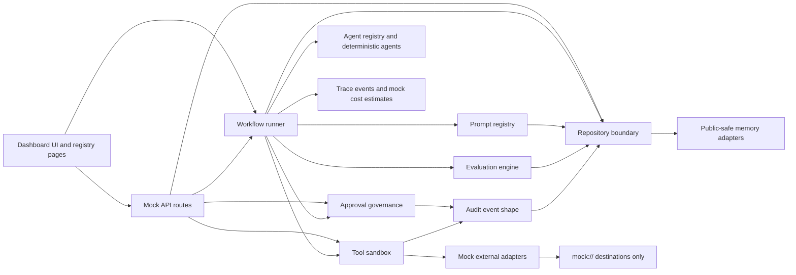

# Architecture Diagram

This diagram shows the public-safe showcase architecture. Every external-looking integration is mocked.

## Boundary Notes

- The UI is real Next.js App Router code.
- The runtime contracts and state transitions are real TypeScript.
- Agents, costs, traces, tools, evaluations, and repository records are deterministic mock examples.
- The repository boundary uses memory adapters only.
- Mock adapters never call external APIs.
- Production would replace memory adapters and mock tools behind the same interfaces.
