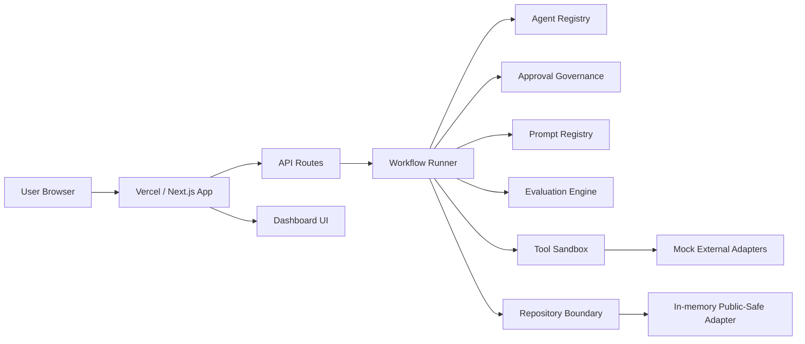
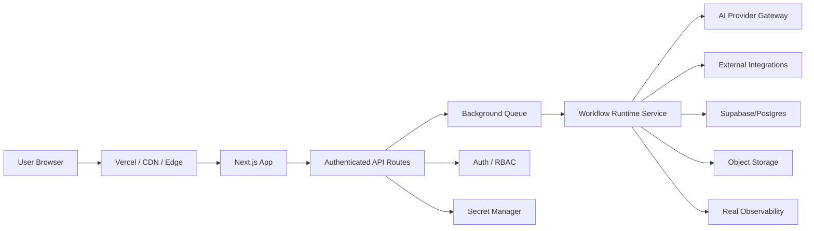

# Cloud Architecture

Stage 9 documents how the public-safe showcase can run as a Vercel preview without connecting to production systems.

## Public-Safe Preview Architecture

## Preview Characteristics

- Hosted as a standard Next.js app.
- Uses static pages and API routes.
- Uses deterministic mock data.
- Uses in-memory repositories only.
- Does not require secrets.
- Does not call real external integrations.

## Future Production Architecture

## Not Implemented In This Repo

- Supabase/Postgres.
- Object storage.
- Background queue.
- Real observability backend.
- Auth/RBAC.
- Secret manager.
- AI provider gateway.
- External integrations.

Those are documented as future productionisation points only.
